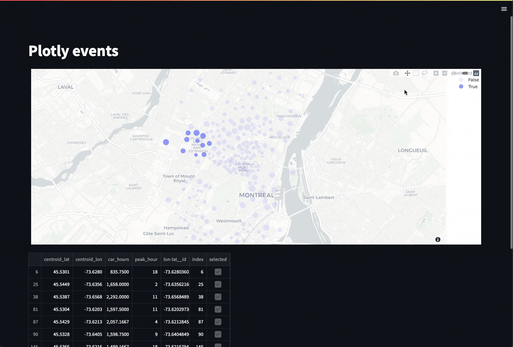

# Streamlit bi-communication plotly map component

The goal is to be able to select elements on a map, and then access the selected elements in streamlit.
And also to update elements on a map, based on events that happened in streamlit.

For example:

1. Select points on a map, with points coloured by a category variable.
2. View the selected points as a table.
3. Change catagory value of all the selected points.
4. Update the color of the points on the map.

The latest example can be found in at `examples/plotly_mapbox_aggrid_multi_select_change_update.py`.

A video of an older example can can be viewed here: <https://youtu.be/2rIpb0LyNgc>



Refer to the "Examples" section for a list of all examples, chronologically built and extended.

## External reference documents

The closest existing component found for the above is:

1. <https://github.com/null-jones/streamlit-plotly-events>
2. <https://github.com/reyemb/streamlit-plotly-mapbox-events>

And a demo that shows plotly being used in this way:

1. <https://github.com/andfanilo/social-media-tutorials/blob/master/20220914-crossfiltering/streamlit_app.py> with a video here: <https://youtu.be/htXgwEXwmNs>

## Examples

### Basic plotly map select view returned results

Just basic illustration of interaction on the map and what is returned via the streamlit-plotly-mapbox-events component:

* `examples/plotly_mapbox_events_example.py`: original example with a bit of modication from <https://github.com/reyemb/streamlit-plotly-mapbox-events> (done for issue [#4](https://github.com/WasteLabs/streamlit_bi_comms_plotly_map_component/issues/4))
* `examples/plotly_mapbox_events_carshare_example.py`: example above extended with example from <https://plotly.com/python/scattermapbox/> (done for issue [#4](https://github.com/WasteLabs/streamlit_bi_comms_plotly_map_component/issues/4))

### Plotly map interaction data-frame filtering

Dataframes are filtered and displayed based on events returned from the streamlit-plotly-mapbox-events component.
It also includes filtering the data-frame based on the map viewpoint (when zooming and panning).
There is still a short-comming in that the map resets to its original viewpoint when events happen.

* `examples/plotly_mapbox_events_carshare_dataframe_filter.py`: extension of `examples/plotly_mapbox_events_carshare_example.py` (done for issue [#6](https://github.com/WasteLabs/streamlit_bi_comms_plotly_map_component/issues/6))

### Potly map interaction with zoom-level retained

Same functionality as above, and with zoom level and pan level maintained:

* `examples/plotly_mapbox_events_carshare_consistent_map_layout.py`: extension of `examples/plotly_mapbox_events_carshare_dataframe_filter.py` (done for issue [#8](https://github.com/WasteLabs/streamlit_bi_comms_plotly_map_component/issues/8))

This forms the basis for more exotic examples.

Known issues:

* Sometimes the map jitters too and from the previous selection area. See issue [#9](https://github.com/WasteLabs/streamlit_bi_comms_plotly_map_component/issues/9).
* When using multiple draw selects (pressing down shift key), the retained draw shapes are as per the previous viewpoint (not the current one). See issue [#10](https://github.com/WasteLabs/streamlit_bi_comms_plotly_map_component/issues/10)

### Potly map with points highlighted based on data-frame selection

A reduced version of the above, where points are highlighted on the map when selected in a dataframe:

* `examples/plotly_mapbox_events_carshare_consistent_map_dataframe_highligh.py`: done for issue [#12](https://github.com/WasteLabs/streamlit_bi_comms_plotly_map_component/issues/12)

### Potly map with pre-colored points highlighted red based on lasso select

Similar to "Potly map interaction with zoom-level retained", but here the points are already coloured based on a category variable. New red points are overlayed to show selections.

* `examples/plotly_mapbox_events_carshare_pre_color_non_clash_select.py`: done for issue [#14](https://github.com/WasteLabs/streamlit_bi_comms_plotly_map_component/issues/14)

### Plotly map with select and change

A comprehensive example, building on all the above. Points can be selected via a table or directly on the map, and can then be reassigned to a new route.

* `examples/plotly_mapbox_aggrid_multi_select_change_update.py`: done for issue [#16](https://github.com/WasteLabs/streamlit_bi_comms_plotly_map_component/issues/16)

## Note on poetry

To get it fully up and running in shell:

```
poetry shell
source $(poetry env info --path)/bin/activate
```
